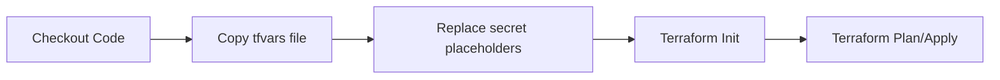

# Configuration Management Guide

## Overview

The infrastructure deployment now uses **version-controlled tfvars files** instead of inline configuration in the pipeline. This provides better configuration management, easier auditing, and clearer separation between environment-specific settings and secrets.

## Configuration Files

### Development: `terraform.tfvars.dev-edge-learning`

- **Purpose**: Development environment with full inference stack for learning
- **Profile**: Enables AKS, API Management, Front Door for understanding ML inference patterns
- **Cost**: ~$220-260/month
- **Features**:
  - AKS cluster (1 node, Standard_D4s_v3)
  - API Management (Developer_1 SKU)
  - Azure Front Door + Traffic Manager
  - Public networking (no private endpoints)
  - 30-day log retention
  - Cost alerts at $75/month threshold

### Production: `terraform.tfvars.prod`

- **Purpose**: Production environment with enhanced security and scalability
- **Profile**: Full production features with private networking
- **Cost**: ~$500-1000/month (depending on usage)
- **Features**:
  - AKS cluster (3 nodes, auto-scaling 2-10)
  - Private endpoints enabled
  - Purge protection enabled
  - 90-day log retention
  - Data Factory integration
  - Backup enabled (90-day retention)
  - Cost alerts at $5000/month threshold

## Secret Management

### Placeholder Pattern

Configuration files use `VAR_` prefixes for values that come from GitHub secrets:

```hcl
project_name       = "VAR_PROJECT_NAME"
location           = "VAR_AZURE_LOCATION"
notification_email = "VAR_NOTIFICATION_EMAIL"
```

### Pipeline Secret Injection

The pipeline automatically replaces these placeholders with actual secret values:

```bash
sed -i "s/VAR_PROJECT_NAME/${{ secrets.PROJECT_NAME }}/g" terraform.tfvars
sed -i "s/VAR_AZURE_LOCATION/$LOCATION/g" terraform.tfvars
sed -i "s/VAR_NOTIFICATION_EMAIL/${{ secrets.NOTIFICATION_EMAIL }}/g" terraform.tfvars
```

### Required GitHub Secrets

| Secret | Description | Example |
|--------|-------------|---------|
| `PROJECT_NAME` | Unique project identifier | `azureml-dev` |
| `AZURE_LOCATION` | Azure region | `eastus` |
| `NOTIFICATION_EMAIL` | Alert email address | `ops@company.com` |
| `AZURE_CLIENT_SECRET` | Azure service principal credentials | JSON object |

## How It Works

### 1. Version Control

All configuration is stored in Git:
- `terraform.tfvars.dev-edge-learning` - Dev configuration
- `terraform.tfvars.prod` - Production configuration
- `terraform.tfvars.minimal` - Minimal cost profile
- `terraform.tfvars.free-tier` - Free tier profile

### 2. Pipeline Workflow



**For Dev:**
```bash
cp terraform.tfvars.dev-edge-learning terraform.tfvars
sed -i "s/VAR_PROJECT_NAME/azureml-dev/g" terraform.tfvars
terraform apply
```

**For Prod:**
```bash
cp terraform.tfvars.prod terraform.tfvars
sed -i "s/VAR_PROJECT_NAME/azureml-prod/g" terraform.tfvars
terraform apply
```

### 3. Benefits Over Inline Configuration

| Aspect | Old Approach (Inline) | New Approach (Version-Controlled) |
|--------|----------------------|-----------------------------------|
| **Configuration Location** | Hardcoded in YAML (60+ lines per env) | Separate tfvars files |
| **Version Control** | Changes buried in pipeline updates | Clear diffs in tfvars files |
| **Auditing** | Git blame shows pipeline changes | Git blame shows config changes |
| **Reusability** | Can't use configs locally | Can run `terraform apply -var-file=...` |
| **Testing** | Must trigger pipeline | Can test locally with same config |
| **Maintenance** | Update 4 places in YAML | Update 1 tfvars file |

## Making Configuration Changes

### Update Dev Environment

1. Edit `infrastructure/terraform.tfvars.dev-edge-learning`
2. Commit and push changes
3. Trigger pipeline: Actions → Infrastructure Deployment → Run workflow → Environment: dev

### Update Prod Environment

1. Edit `infrastructure/terraform.tfvars.prod`
2. Commit and push changes
3. Trigger pipeline: Actions → Infrastructure Deployment → Run workflow → Environment: prod

### Add New Feature Flag

1. Add variable to `infrastructure/variables.tf`
2. Update all tfvars files with the new flag
3. Use flag in Terraform resources with conditional logic

## Local Development

You can now use the same configuration locally:

```bash
cd infrastructure

# Use dev configuration
terraform plan -var-file=terraform.tfvars.dev-edge-learning \
  -var="project_name=my-local-test" \
  -var="location=eastus" \
  -var="notification_email=me@example.com"

# Use production configuration
terraform plan -var-file=terraform.tfvars.prod \
  -var="project_name=my-prod-test" \
  -var="location=westus2" \
  -var="notification_email=ops@example.com"
```

## Configuration Profiles Comparison

| Feature | minimal | free-tier | dev-edge-learning | prod |
|---------|---------|-----------|-------------------|------|
| **AKS** | ❌ | ❌ | ✅ (1 node) | ✅ (3 nodes) |
| **APIM** | ❌ | ❌ | ✅ Developer_1 | ✅ Developer_1 |
| **Front Door** | ❌ | ❌ | ✅ | ✅ |
| **Redis Cache** | ❌ | ❌ | 🔧 Optional | 🔧 Optional |
| **GPU Compute** | ❌ | ❌ | 🔧 Optional | 🔧 Optional |
| **Private Endpoints** | ❌ | ❌ | ❌ | ✅ |
| **Purge Protection** | ❌ | ❌ | ❌ | ✅ |
| **Data Factory** | ❌ | ❌ | ❌ | ✅ |
| **Backup** | ❌ | ❌ | ❌ | ✅ (90 days) |
| **Log Retention** | 30 days | 30 days | 30 days | 90 days |
| **Monthly Cost** | ~$15-20 | ~$15-20 | ~$220-260 | ~$500-1000 |

## Troubleshooting

### Secret Replacement Not Working

**Symptom**: Terraform tries to use literal `VAR_PROJECT_NAME` value

**Solution**: Check GitHub secrets are configured:
```bash
# In GitHub repo: Settings → Secrets and variables → Actions
# Ensure PROJECT_NAME, AZURE_LOCATION, NOTIFICATION_EMAIL exist
```

### Wrong Configuration Applied

**Symptom**: Dev environment has prod settings

**Solution**: Verify correct tfvars file is copied in pipeline step:
- Dev jobs should use: `cp terraform.tfvars.dev-edge-learning terraform.tfvars`
- Prod jobs should use: `cp terraform.tfvars.prod terraform.tfvars`

### Local Testing Issues

**Symptom**: Can't run Terraform locally with same config

**Solution**: Replace VAR_ placeholders manually:
```bash
cp terraform.tfvars.dev-edge-learning terraform.tfvars
sed -i "s/VAR_PROJECT_NAME/my-test/g" terraform.tfvars
sed -i "s/VAR_AZURE_LOCATION/eastus/g" terraform.tfvars
sed -i "s/VAR_NOTIFICATION_EMAIL/me@example.com/g" terraform.tfvars
terraform plan
```

## Migration Notes

### What Changed

1. **Removed**: 60+ lines of inline `cat > terraform.tfvars << EOF` in pipeline
2. **Added**: `cp terraform.tfvars.{profile} terraform.tfvars` + secret replacement
3. **Updated**: Dev-edge-learning and prod tfvars files to use VAR_ placeholders
4. **Created**: This documentation file

### Impact

- ✅ **Positive**: Better version control, easier local testing, clearer configuration
- ✅ **Positive**: Same behavior as before (secrets still injected securely)
- ⚠️ **Neutral**: Requires understanding VAR_ placeholder pattern
- ❌ **None**: No breaking changes, secrets still required

## Best Practices

1. **Never commit secrets** - Use VAR_ placeholders for sensitive values
2. **Test locally** - Use `-var` flags to override placeholders for local testing
3. **Document changes** - Update this file when adding new configuration options
4. **Review diffs** - Configuration changes now visible in pull requests
5. **Use profiles** - Choose appropriate profile (minimal/dev/prod) for your needs

## Next Steps

1. Review `terraform.tfvars.dev-edge-learning` and adjust settings for your needs
2. Ensure all GitHub secrets are configured
3. Trigger a dev deployment to verify new configuration approach
4. Monitor costs and adjust `monthly_budget_amount` if needed
5. Enable optional features (Redis, GPU) when ready

## Related Documentation

- [Infrastructure Alignment Guide](INFRA_ALIGNMENT.md)
- [Pipeline Cleanup Configuration](PIPELINE_CLEANUP_CONFIG.md)
- [Terraform Backend Setup](TERRAFORM_BACKEND_GUIDE.md)
- [Quick Start Guide](QUICK_START_FREE_TIER.md)
