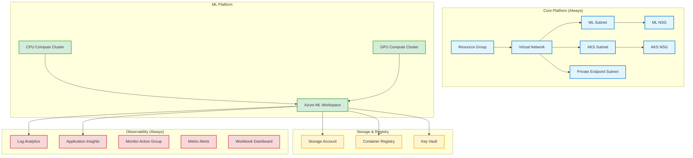
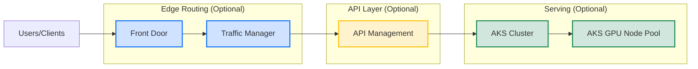
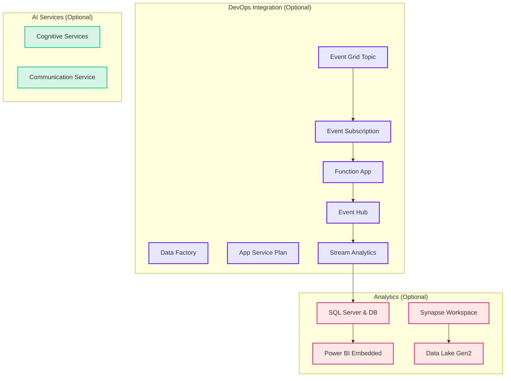
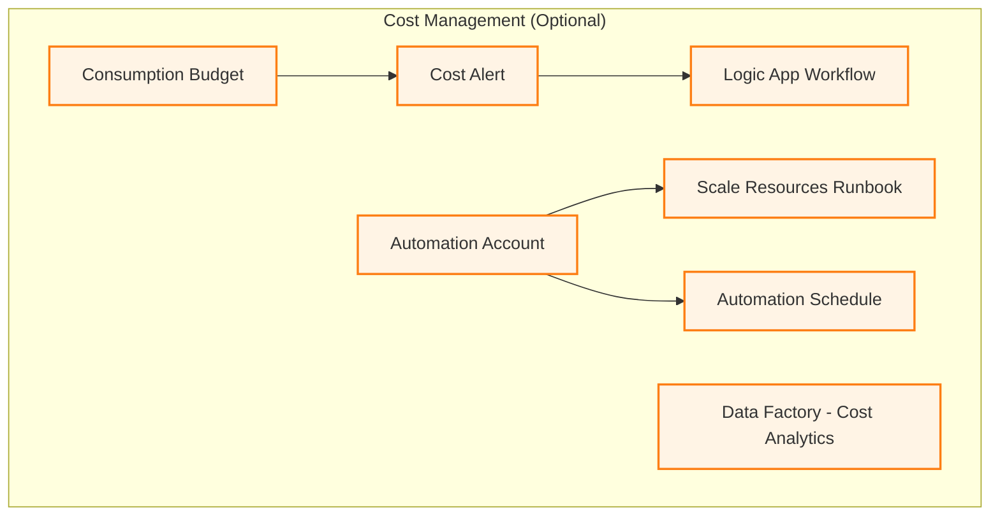
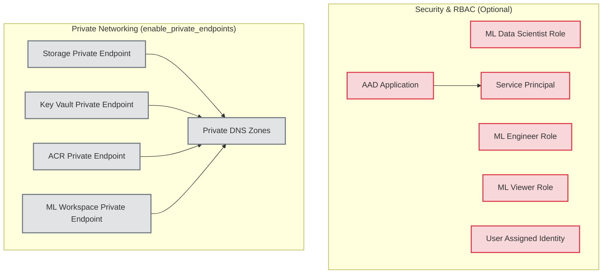

# MLOps Infrastructure Architecture

Comprehensive architecture diagram showing all Azure resources defined in Terraform, organized by layer and feature flags.

## Core Infrastructure (Always Deployed)



## Optional: Serving & Edge Stack (enable_aks_deployment, enable_api_management, enable_front_door, enable_traffic_manager)



## Optional: DevOps Integration (enable_devops_integration + sub-flags)



## Optional: Cost Management & Optimization (enable_cost_alerts, enable_logic_app)



## Optional: Security & RBAC (enable_custom_roles, enable_cicd_identity)



## Resource Summary by Profile

### YOUR CURRENT PROFILES

#### Minimal Profile (`terraform.tfvars.minimal`)
**Purpose**: Smallest safe footprint for training + inference (MVP)

**Core Infrastructure (Always Deployed)**
- ✅ Resource Group
- ✅ Virtual Network (VNet) with 3 Subnets (ML, AKS, Private Endpoint)
- ✅ Network Security Groups (ML NSG, AKS NSG)
- ✅ Storage Account (datasets, artifacts, model files)
- ✅ Azure Container Registry (ACR) - container images
- ✅ Key Vault (secrets, keys, certificates)

**ML Platform**
- ✅ Azure ML Workspace
- ✅ CPU Compute Cluster (autoscale to 0)
- ✅ GPU Compute Cluster (autoscale to 0)

**Monitoring & Observability**
- ✅ Log Analytics Workspace
- ✅ Application Insights
- ✅ Monitor Action Group (email alerts)
- ✅ Metric Alerts (ML job failures, storage availability)
- ✅ Workbook Dashboard
- ✅ Diagnostic Settings (ML Workspace, Storage)

**Cost Management**
- ✅ Consumption Budget ($50/month alert)
- ✅ Data Factory (cost analytics)
- ✅ Automation Account + Runbook (cost optimization)
- ✅ Automation Schedule (hourly checks)

**NOT Included in Minimal**
- ❌ AKS, APIM, Front Door, Traffic Manager
- ❌ DevOps Integration (Function App, Event Grid, Stream Analytics, Event Hub)
- ❌ Analytics (Power BI, SQL, Synapse, Data Lake Gen2)
- ❌ AI Services (Cognitive Services, Communication Service)
- ❌ Logic Apps
- ❌ Custom RBAC Roles, CI/CD Identity
- ❌ Private Endpoints

**Estimated Monthly Cost**: ~$0-50 (mostly ML compute when running jobs)

---

#### DEV Edge Learning Profile (`terraform.tfvars.dev-edge-learning`)
**Purpose**: Full-scale inference routing practice (AKS + APIM + Front Door + Traffic Manager)

**Everything in Minimal Profile, PLUS:**

**Serving & Edge Stack**
- ✅ AKS Cluster (1 node, Standard_D4s_v3) + GPU Node Pool
- ✅ API Management (Developer_1 SKU, public endpoint)
- ✅ Azure Front Door (Standard SKU, global entry point)
- ✅ Traffic Manager (DNS-based routing/failover)
- ✅ AKS Diagnostic Settings
- ✅ AKS Metric Alerts (CPU/memory usage)

**Still NOT Included**
- ❌ DevOps Integration (Function App, Event Grid, etc.)
- ❌ Analytics (Power BI, SQL, Synapse)
- ❌ Custom Roles, CI/CD Identity
- ❌ Private Endpoints (using public for learning simplicity)

**Estimated Monthly Cost**: ~$75-150 (AKS node + APIM + Front Door usage)

---

### Full Enterprise (Hypothetical - all flags enabled)
**For reference only - not defined in your current tfvars files**

- ✅ All Core + ML + Monitoring
- ✅ AKS + APIM + Front Door + Traffic Manager
- ✅ DevOps Integration (Function App, Event Grid, Stream Analytics, Event Hub)
- ✅ Analytics (Power BI, SQL Server + DB, Synapse + Data Lake Gen2)
- ✅ AI Services (Cognitive Services, Communication Service)
- ✅ Cost Management (Budget, Automation, Logic Apps)
- ✅ Custom Roles (ML Data Scientist, ML Engineer, ML Viewer), CI/CD Identity
- ✅ Private Endpoints (Storage, Key Vault, ACR, ML Workspace)
- ✅ Private DNS Zones

**Estimated Monthly Cost**: $500+ (APIM, SQL, Synapse, Function Apps, private networking)

## How to Verify Alignment

Use the verification script to compare your actual Azure resources with Terraform:

```powershell
# Compare Azure RG vs Terraform state
./deployment/verify-alignment.ps1 -ResourceGroupName <your-rg>

# Run plan to detect drift
./deployment/verify-alignment.ps1 -ResourceGroupName <your-rg> -VarFile infrastructure/terraform.tfvars.minimal -RunPlan
```

See `documentation/INFRA_ALIGNMENT.md` for details.

## Notes
- Diagrams reflect Terraform definitions, not necessarily deployed resources (depends on tfvars flags)
- For aligned infra: ensure `terraform plan` shows 0 to add/change/destroy
- Use import script (`infrastructure/import-existing-resources.sh`) if resources exist outside Terraform
