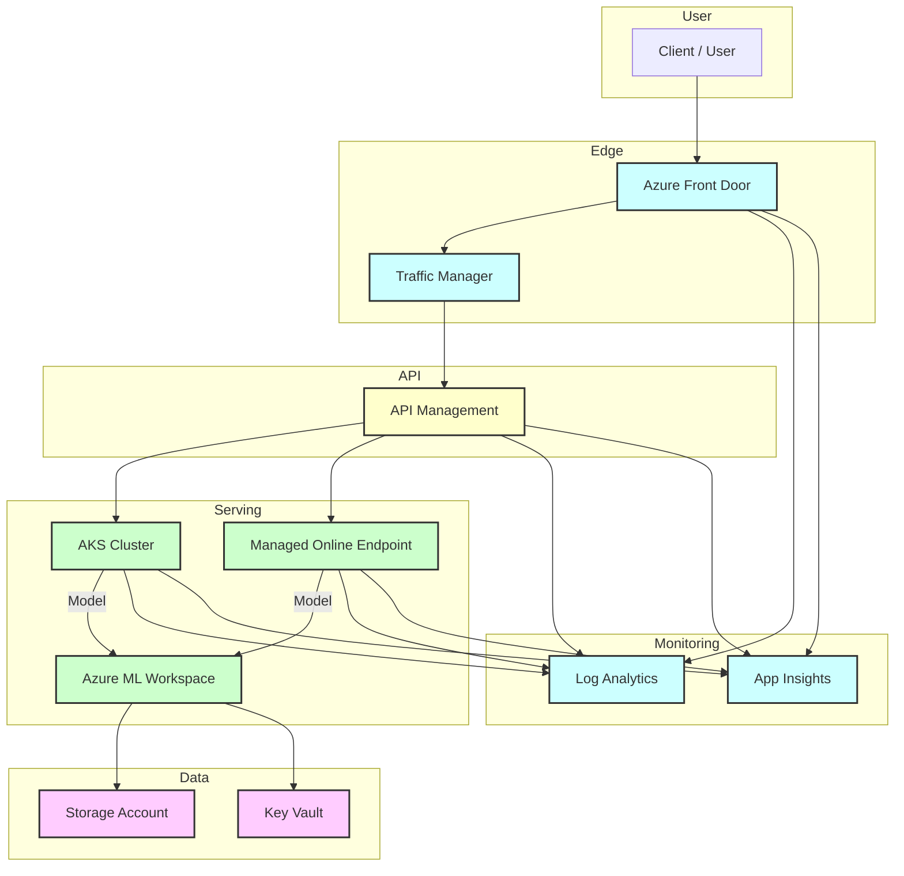

# DEV Edge Learning Architecture (AKS, APIM, Front Door, Traffic Manager)

Below is a detailed architecture diagram for your DEV learning environment, showing how inference endpoints flow through AKS, APIM, Front Door, and Traffic Manager, with supporting Azure ML, Storage, Key Vault, and monitoring components.

## Diagram (Mermaid source)

## How to use
- View this diagram in VS Code markdown preview, or paste into https://mermaid.live for a rendered image.
- To export as PNG: use the Mermaid Live Editor or VS Code Mermaid extension.

## Component notes
- **Front Door**: Global entry, WAF, routes to Traffic Manager or APIM.
- **Traffic Manager**: DNS-based routing/failover, health probes.
- **API Management**: Auth, rate limiting, policies, developer portal.
- **AKS**: Custom model serving, ingress controller, microservices.
- **AML Managed Endpoint**: Direct managed serving (alternative to AKS for simple cases).
- **Azure ML Workspace**: Training, model registry, pipeline orchestration.
- **Storage Account**: Datasets, artifacts, model files.
- **Key Vault**: Secrets, keys, credentials.
- **Log Analytics / App Insights**: Monitoring, logs, metrics, alerts.

## Flow
- User requests enter via Front Door, routed by Traffic Manager to APIM, which authenticates and forwards to AKS or AML endpoint.
- Model serving in AKS or AML endpoint; logs/metrics sent to monitoring.
- Data and secrets accessed from Storage and Key Vault.

---
Edit this diagram as your architecture evolves. For production, add private endpoints, scale out AKS, and enable advanced APIM/Front Door policies.
